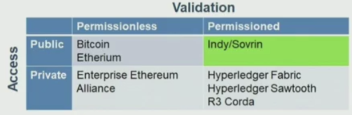

# Hyperledger
> Estudio de tecnologías de SSI Indy && Aries, y diferencias respecto AlastriaID. Conocer si existen los mismos actores/verbos que en SSI AlastriaID, modelo de datos conforme a W3C y forma de emisión de Credenciales Verificables Cualficadas (en caso de que exista este concepto)

Hyperledger es una comunidad Open Source dedicada al desarrollo de frameworks, herramientas y librerías orientadas al desarrollo blockchain en empresas.

---------
## Hyperledger VS Ethereum VS Bitcoin

- **Bitcoin** se enfoca en **dinero** descentralizado.

- **Ethereum** se enfoca en **aplicaciones** descentralizadas.

- **Hyperledger Indy** se enfoca en **identidad** descentralizada.

En esta imagen pueden verse las diferencias entre las distintas redes Blockchain principales existentes. Estas se pueden clasificar como públicas o privadas, y con o sin permisos.

Indy es una red Blockchain **pública y con permisos**. Esto implica que cualquier usuario puede formar parte de ella, pero solo poseerá ciertas capacidades dentro, las cuales vendrán especificadas por el tipo de permisos que posea.

-------------------------------------
## Hyperledger Indy

[Chat oficial para discutir sobre Hyperledger Indy](https://chat.hyperledger.org/channel/indy)

Ledger (libro electrónico) orientado a **Identidad**, aunque puede usarse para otros propósitos.

Se divide en dos componentes:

- **Indy-Plenum**: Protocolo de consenso y Ledger.

- **Indy-Node**: Depende de Indy-Plenum. Las transacciones que maneja son específicamente sobre Identidad.

Indy está escrito en Python, con dependencias de ZMQ, Indy-Crypto (Ursa) y Libsodium.
Existen varios tests para probar el ledger.
Posee arquitectura modular y es message-driven

El hecho de ser una red permisionada, lleva a la existencia de distintos tipos de nodos.

- **Nodos Validadores**. Son aquellos que **participan en el consenso**. Poseen la capacidad de **lectura y escritura** en el ledger.
Basados en TCP y encriptado de autenticación en lugar de firmas digitales (*Poly1305 MAC*).
Cada nodo tiene replicado todos los ledgers, y cada uno de estos ledgers tiene un Árbol de Merkle. La mayoría de estos ledgers posee, además, un estado basado en Patricia Merkle Trie.
Poseen implementado el Plenum Consensus Protocol (RBTF) y BLS sigs para verificar los datos escritos en el Ledger, siendo así parte del consenso. 

- **Nodos Observadores**. Son aquellos que obtienen el estado del ledger de los Nodos Validadores de manera síncrona. Poseen la capacidad de **lectura** del ledger.

Para evitar un ataque de 51% en la escritura del ledger, es necesario poseer 3F+1 nodos validadores, donde F es el número de nodos maliciosos.

Cuando se realiza una petición de **escritura**, como una transacción, esta se envía a los nodos validadores. 

El cliente que solicita la escritura de esa transacción, la firma previamente de manera múltiple con el algoritmo de **firma digital Ed25519**, se envía a todos los nodos validadores y la respuesta admitida es aquella dada por la mayoría de estos nodos.

Para realizar una petición de **lectura**, el solicitante no necesita firmar la transacción petición. Esta es enviada a un nodo validador, y con una **única respuesta de un nodo validador** es suficiente. Esta respuesta contiene agregada la **firma BLS** y la prueba de estado de auditoría, con el fin de que el cliente que solicitó la lectura pueda corroborar la veracidad del contenido obtenido como respuesta.

De este modo, la autenticación se realiza según la prueba presentada junto a la transacción. Si esta prueba es una firma digital, se contrasta con la clave pública almacenada en el Ledger, la cual va asociada al mismo DID de la transacción.

El hecho de que en una petición de lectura solo responda un único nodo incrementa la eficiencia y rapidez de respuesta.

La autorización asociada al rol se encuentra asociada al DID.

-----

Existen varios ledger con distinta información contenida, cada uno gestiona unos aspectos de Indy:

- **Audit Ledger**. **Gestiona** al resto de ledgers.

- **Pool Ledger**. Transacciones para cada uno de los nodos en la pool. Contiene lo referente a **añadir, editar o eliminar nodos** y su información. Es donde están las claves públicas para validar DIDs.

- **Config Ledger**. Configuraciones referentes a los **parámetros de las pools**. Es usado en la validación de transacciones.

- **Domain Ledger**. Datos sobre transacciones específicas referentes a **identidad** y datos sobre transacciones específicas referentes a **aplicaciones**.

El **State** o estado es el almacenamiento del orden de las transacciones llevadas a cabo.

### **Protocolo de consenso**

El protocolo de consenso está basado en **BFT**, es decir, todos los nodos desconfían de todos. Es el conocido protocolo bizantino.

Dentro de este, la variante usada es **RBFT** **(Redundant Byzantine ault Tolerance).**

Su funcionamiento es más óptimo que Proof-of-Work. Así es mejor en redes permissioned.

El protocolo, al ser **leader based**, es susceptible de que el líder sea malicioso o pueda desconectarse, por lo tanto validando transacciones que no debieran ser válidas o a la inversa.
Para evitar esto, este rol de **nodo primario se va cambiando, realizando varias validaciones o views**(de ahí el redundante), cada una con un nodo como primario. Así cada view tiene un primary distinto.

Cuando el contenido de un nodo Replica es igual al del Primary, su contenido se cambia, reordenando las transacciones como dictamina el primario.

La estructura del Árbol de Merkle que utiliza Indy emplea BLS aggregated signature. 
Esto significa que el **nodo raíz del Patricia Merkle Trie está firmado por todos los nodos validadores.**
De este modo, cuando un usuario solicita la lectura del ledger, y solo le responde un único nodo cuando se efectúa esa transacción, este puede comprobar que esa firma pertenece a la raíz del árbol.
Además, para evitar que un nodo validador maligno envíe una respuesta maliciosa, de intentar hacer eso, este valor raíz del árbol de su copia del ledger cambiaría. Así,**cualquier usuario puede comprobar la raíz del árbol y si este no coincide con el que debe ser, rechazar ese resultado malicioso**.

--------------------

## Hyperledger Aries

[Chat oficial para discutir sobre Hyperledger Aries](https://chat.hyperledger.org/channel/aries)

Se trata de una **infraestructura para interacciones peer-to-peer basadas en blockchain.**

Incluye:

- Una **interfaz** blockchain para **crear y firmar transacciones** blockchain.
- Una **wallet de almacenamiento seguro** para guardar la informacion criptográfica secreta necesaria para construir clientes blockchain.
- Un **sistema de mensajes cifrados** para interacciones fuera del ledger entre clientes, utilizando varios protocolos de transporte.
- Una implementación de **Credenciales Verificables** usando el **modelo de datos W3C** y siendo ZKP-capable, empleando las Zero-Knowledge-Proof primitivas que se encuentran en **Hyperledger Ursa**.
- Una implementación de la especificación **Decentralized Key Management System (DKMS)**, actualmente siendo incubada en Hyperledger Indy.
- Un **mecanismo** para construir **protocolos de alto nivel** y **casos de uso para APIs** basados en la funcionalidad de mensajería segura mencionada anteriormente.

Posee una comunidad open-source para elaborar frameworks, herramientas y librerías para la creación de entidades y credenciales propias de la Self-Sovereign Identity.

Facilita el intercambio de datos, funcionando peer-to-peer **sobre la estructura de blockchain Hyperledger Indy.**

De este modo **puede acceder a la información almacenada en el ledger** (libro de contabilidad pública) **de Indy**.

Hyperledger Aries **especifica** lo siguiente:
- Agentes que interaccionan, propios de la Identidad Autosoberana: Issuer, Holder y Verifier.  
- DIDcomm. 
- Protocolos. 
- Administración de claves.

Hyperledger Aries **engloba** lo siguiente:
- RFC's referentes a los anteriores puntos.
- Frameworks para el manejo de agentes.
- Herramientas de desarrollo.
- Librerías.

Todas estas herramientas permiten la creación de entidades cuyos DIDs puedan registrarse en el Ledger como **Issuers, Holders o Verifiers.**
También permite la creacion y emisión de **Credenciales Verificables** acorde al modelo de Identidad Autosoberana.

[Repositorio para generación de Issuer](https://github.com/bcgov/aries-vcr-issuer-controller)

[Repositorio para generación de VCs](https://github.com/bcgov/aries-vcr/tree/master/docs)

[Crear registro de credencial](https://github.com/bcgov/aries-vcr/blob/master/docs/create-new-credential-registry.md)

-----------------
## Modelo de datos usado. W3C

Como pudo verse, **Hyperledger Aries implementa las VCs tal y como el modelo de W3C especifica**. Incorpora a esto el uso de Zero Knowledge Proofs (ZKP) usando Hyperledger Ursa.

--------------
## Hyperledger VS AlastriaID

Hyperledger y AlatriaID son dos ecosistemas con bastante en común pero diferencias en los despliegues de sus aplicaciones y subida de sus transacciones.

La estructura, en ambos casos, para hacer uso de la Identidad Autosoberana, consiste en **Decentralized IDentifiers** (DIDs) asociados a la información blockchain; y protocolos bizantinos para la validación de las transacciones.

Poseen también en común la **estructura de la Identidad Autosoberana**, tratando el mismo tipo de entidades Issuer, Holder y Verifier; y de Credenciales Verificables.

Ambas poseen como base el modelo de **W3C** para ello.

**Hyperledger funciona utilizando dockers y python**. **AlastriaID** si bien posee está opción, está todavía por desarrollarse en las librerías de python, funcionando actualmente con **javascript y node**.

Por otro lado, **Hyperledger funciona sobre su propia red pública y permisionada de blockchain, Hyperledger Indy**.

**AlastriaID** sin embargo, **funciona con Smart Contracts solidity desplegados en la red de Ethereum.**

El **CNIL** elaboró, en noviembre de 2018, un informe tratando los distintos problemas que podrían darse al aplicar la tecnología **Blockchain en ciertos ámbitos dentro de la UE**. 
Este informe es el siguiente: https://www.cnil.fr/sites/default/files/atoms/files/blockchain_en.pdf

Igualmente, hay aunque haya que tener en cuenta que se elaboró hace ya un tiempo y quizá algún apartado haya podido ser solventado con nuevas soluciones, se trata de un informe bastante interesante a la hora de **cumplimentar el RGPD al hacer uso de la tecnología Blockchain.**

Uno de los apartados trata los problemas de emplear una Blockchain pública **no** **permisionada**.

Entre los problemas que surgían estaba el **debate sobre el minado**.
Al enviar la transacción a minar, esta puede **salirse de los límites físicos de la UE** en caso de que sea minada por un nodo fuera de esta.

En tal caso la información se saldría de la UE para ese cometido, llevando esto a dilemas sobre la aplicación de la **normativa de transferencia de datos fuera de la UE**, así como **si sería aplicable el RGPD** a esos datos al estar fuera de la UE.

Por otro lado, en caso de usarse una **Blockchain permisionada, este problema quedaría** resuelto al estar restringiendo el minado a aquellos **nodos bajo el control de la UE**.

Es por esto que, Hyperledger **Indy** se ve favorecida como Blockchain permisionada. Sin embargo, existen redes construidas sobre clientes Ethereum, y por tanto que permiten el uso de Solidity para programar Smart Contracts para ellas; que pueden ser usadas como permisionadas o privadas. Por ejemplo, **Besu** es una de ellas. 

Estas capas de red sobre Ethereum se ven también favorecidas tras EIP 1559, el hard fork London que se producirá en agosto de 2021 e incentivará el desarrollo de segundas capas, descongestionando a su vez la Mainnet.

Lo que sí o sí debe cumplirse es la **transparencia** de la Blockchain. Es por eso que esta debería ser **pública**, para que cualquier ciudadano pudiera ver las transacciones realizadas. Esta característica **es cumplida por ambas** redes blockchain, Ethereum e Indy.

-----

Otra diferencia entre AlastriaID e Hyperledger se encuentra en la **forma de evitar la correlación entre actividades que haga un Holder**.

Por un lado, **AlastriaID** lo que hace es **subir a la Blockchain una serie de hashes** en lugar de la clave pública del Holder.

La primera hash con la que trabaja y que genera es resultado de concatenar el **token de la VC y el DID del Issuer**, esto al crear una nueva VC.

La segunda, es resultado de concatenar **la VC y el DID del Verifier**.

De este modo, **ambas hashes son imposible de correlacionar** por la VC, pues al concatenar más información los resultados son distintos.

De este modo, ni el Issuer ni el Verifier pueden realizar un seguimiento de las acciones que lleve a cabo el Holder con sus Credenciales Verificables.

Por otro lado, **Hyperledger** en lugar de manejar varias hashes, **emplea distintos DIDs para el Holder dependiendo del Verifier** con el que esté interactuando.

De este modo, **el Holder posee varios identificadores que no pueden correlacionarse entre sí**, y de este modo las demás entidades no pueden seguir el histórico de sus acciones.

---------------------------
## Emisión de Credenciales Verificables Cualificadas
Como pudo verse, la implementación de Hyperledger Aries se basa en el modelo de **W3C** para VCs. 
Al hacer uso de este modelo, de forma derivada se pueden crear VCs cualificadas **tal y como eIDAS describe para W3C, usando proofs en formato de datos enlazados.**

Es por ello que el modo de generarlas sería igual, **la única diferencia es a qué blockchain se suben las transacciones.**

------------------------
## Identidad Digital Federada
> Como añadido, ver la implementacion de Identidad Digital FEDERADA (Ver estudio Tecnalia)

La Identidad Federada permite la **gestión de identidad en sistemas de información de manera independiente entre compañías**.

Esto significa que los usuarios pueden emplear una **misma identidad** para identificarse en **distintos departamentos** de una misma o varias empresas, poniendo solución al problema de la gestión de identidades múltiples.

Es una idea similar a Single Sign-On, donde un usuario emplea unas mismas credenciales (nombre y contraseña) para acceder a varios servicios (como las credenciales de Google para acceder a Gmail y YouTube u otros servicios asociados).

Cada uno de los servicios donde el usuario se autentica con este método, mantiene la sesión iniciada de forma independiente. Esto implica que cerrarla en uno no la cerrará del resto.

Con la Identidad Federada, las credenciales del usuario se envían a una **Aplicación Federada de confianza**. Esta comprueba tanto al usuario como al proveedor de servicios al que se quiere acceder. 

Si el **usuario pertenece a la federación** y **posee los permisos necesarios para acceder al servicio solicitado**, la Aplicación Federada indica al proveedor de servicios que **permita el acceso** al usuario sin realizar un intercambio de credenciales con este.

Aquí **si el usuario se desconecta de su proveedor de identidad**, con ello **también se desconecta de la Aplicación Federada y de todos los servicios** a los que haya accedido con este método.

---------------------
## La Identidad Federada frente a la Identidad Autosoberana.

| Característica                                                           | Identidad Federada                                                       | Identidad Autosoberana                         |   |   |
|--------------------------------------------------------------------------|--------------------------------------------------------------------------|------------------------------------------------|---|---|
| Las entidades poseen control absoluto sobre cómo se usan sus identidades | No                                                                       | Sí                                             |   |   |
| Disponibilidad                                                           | Depende del proveedor                                                    | No depende de una fuente concreta. Más estable |   |   |
| Vulnerable a ciberataques                                                | Al ser centralizada, más alta                                            | Muy difícil debido a la descentralización      |   |   |
| Posibilidad de uso de Zero-Knowledge-Proof                               | No                                                                       | Sí                                             |   |   |
| Usable por terceros para fines financieros                               | Sí                                                                       | Sí con autorización previa                     |   |   |
| Los individuos pueden permitir divulgaciones selectivas de sus datos     | Muy limitado                                                             | Sí                                             |   |   |
| Habilidad para usar las mismas credenciales en otros proveedores         | Sí si el servicio está registrado en el gestor de identidades federadas  | Sí si el proveedor es Service Provider         |   |   |

Si bien la **Identidad Federada es menos privada para el usuario**, actualmente puede ser una solución **más fácil** para las empresas a la hora de gestionar las credenciales de sus usuarios.

Sin embargo, está claro que a gran escala, cuando terceros entran en acción, ha de prevalecer la privacidad de los usuarios, y con ello, la Identidad Autosoberana prevalece ante la Identidad Federada.

> Mashenka-ad